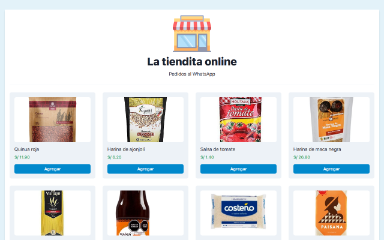

# Google Sheets Store

A web app where you can select the desired products and when proceeding to the checkout, you will be redirected to a WhatsApp profile.

I am using Google Sheets as the database, so every product that is registered there will appear on the frontend.

Built with TypeScript, Next.js, ChakraUI, Google sheets and the WhatsApp API. Project based on [this video](https://youtu.be/DgPcpte1eoA)

You can view [live version here](https://google-sheets-store.jorgeyza.com/)

## How to run

1. You can use [this google sheet document](https://docs.google.com/spreadsheets/d/1Qq38enSWKPWt8CwYdAZEpiWI-9njUbDnqcyjL9p4zxE/edit?usp=sharing) as a base.
2. Publish it to the web as a csv document.
3. Change `googleSheetLink` variable in `product/api.ts` with the link that google sheets provides you after publishing the document to the web as a csv.
4. Run project with `pnpm dev`.
